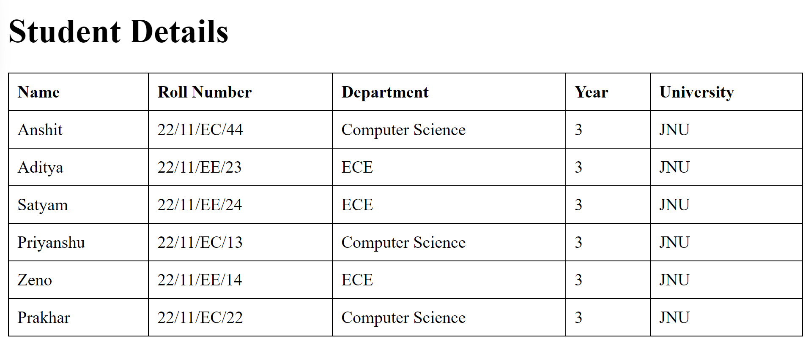
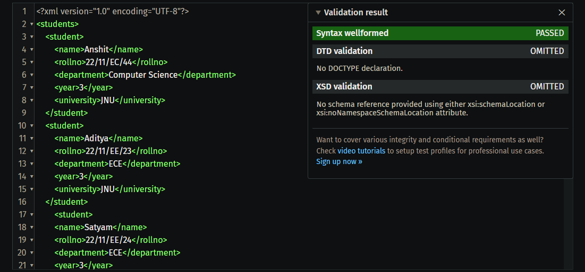

# Student Details Project

This project contains an XML file for student details and an HTML file that displays this information in a tabular format.

## Deployed Link
You can view the live version of the project at: [https://anshitsinha.github.io/XMLStudentProject/](https://anshitsinha.github.io/XMLStudentProject/)

## Files Included
- `students.xml`: XML file containing student details.
- `index.html`: HTML file that fetches and displays student information from the XML file.

## Output
Below is a screenshot of the output displayed in the web browser:

## XML Validation
The XML file has been validated to ensure it is well-formed and valid. Below is the validation proof:

## How to Run
1. Open `index.html` in a web browser to view the student details.
2. Ensure that both `students.xml` and `index.html` are in the same folder.

## Validation Tools Used
- [XML Validation Tool](https://www.truugo.com/xml_validator/) for checking XML well-formedness and validity.

## Conclusion
This project demonstrates the use of XML for data representation and how to fetch and display this data in a web page.
